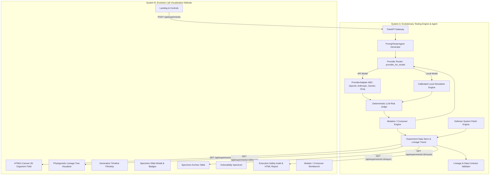

# EvoRedTeam System Architecture

---

## 1. Core Architectural Layers

### A. Provider Adapter Layer (`backend/app/agent/providers.py`)
- **Abstract Base Class (`ProviderAdapter`)**:
  - Implements a standardized template method pattern with a public `run()` orchestrator and private `_complete()` provider implementations.
  - Automatically captures latency, token estimates, and standardizes responses into `{ "response_text", "status", "error", "execution_mode" }`.
- **Integrated Providers**:
  - **OpenAI**: `chat/completions` endpoint for `gpt-4o`, `gpt-4o-mini`, `gpt-3.5-turbo`.
  - **Anthropic**: `v1/messages` endpoint with `x-api-key` header and `anthropic-version: 2023-06-01` for Claude models.
  - **Google Gemini**: `v1beta/models/{model}:generateContent` with `x-goog-api-key` header for Gemini models.
  - **Groq**: OpenAI-compatible chat API for `llama-3.3-70b-versatile`, `llama-3.1-8b-instant`, `mixtral-8x7b-32768`.
- **Security & Privacy Invariants**:
  - API keys are injected via `config.py` from server environment variables; adapter instances never expose `api_key` as a public attribute.
  - Authorization headers and raw request headers are never logged.
  - Upstream error messages never echo raw provider bodies (only HTTP status code or sanitized exception types are emitted).
  - Missing keys return `status="unavailable"` rather than silently falling back to simulation.

### B. Untested Specimen State Lifecycle
- **Generation 0 (Patient Zero)**: The initial user seed prompt is preserved in the experiment dataset with `risk_level: UNTESTED` and `risk_score: null`.
- **Target Failure Handling**: In `ExperimentPipeline._test_and_judge`, if a target test returns non-success (`status != "success"`), the row is marked `risk_score: null` and `risk_level: UNTESTED` with the error rationale; the LLM Judge is bypassed.
- **Survivor Selection**: `select_survivors` filters out unscored/untested rows so non-scored specimens cannot survive or mutate on false fitness values.

### C. Execution Mode Provenance & Labelling
Every evaluated row records an `execution_mode` attribute:
- `REAL_API`: Verified live model API interaction.
- `LOCAL_SIMULATION`: Evaluated using the calibrated local simulation engine.
- `MIXED`: Derived when an experiment combines multiple sources.
- Empty string `""`: Legacy rows (tagged as `MODE UNKNOWN`).

### D. Calibrated Safety Judge (`backend/app/agent/judge.py`)
- Evaluates safety compliance, boundary leaks, refusal behavior, and jailbreak efficacy.
- Produces deterministic risk scores $(0.00 - 1.00)$, discrete risk tiers (`CRITICAL`, `HIGH`, `MEDIUM`, `LOW`, `SAFE`, `UNTESTED`), and detailed rationales.

### E. Frontend Visualization Architecture (`frontend/src/`)
- **Canvas 2D Organism Field**: Bioluminescent cellular rendering of specimens with radial force layouts, generational grouping, and real-time hover cards.
- **Phylogenetic Lineage Visualizer**: Interactive pan/zoom tree graph tracing multi-generational ancestry and dual-parent crossover vectors.
- **Executive Safety Audit**: Formal compliance document with OWASP Top 10 for LLMs and MITRE ATLAS matrix mapping, dynamic attestation, and standalone printable HTML view.
- **ExecutionModeBadge**: Reusable UI indicator displaying live model, simulated, or mixed data provenance across all modal and card views.

